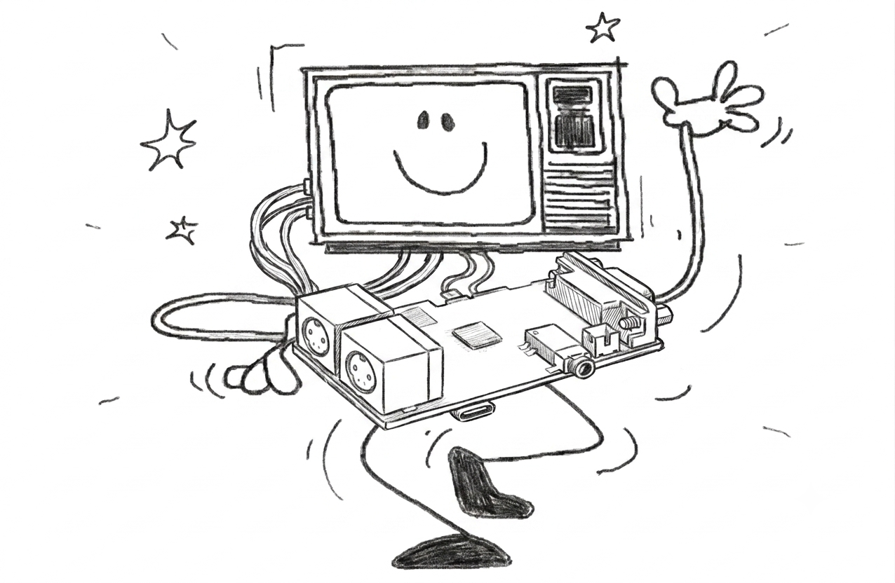

# TTGO-VGA32-COCO — CoCo 2 & CoCo 3 Emulator for the LilyGo TTGO VGA32



A full **TRS-80 Color Computer** (CoCo 2 and CoCo 3) emulator running on the **LilyGo TTGO VGA32 v1.4** board (ESP32-WROVER). Ported from the [XRoar](http://www.6809.org.uk/xroar/) emulator by Ciaran Anscomb.

**v0.6 — June 15, 2026** (LilyGo TTGO VGA32 port)

## Features

- **One firmware, two CoCos** — CoCo 2 and CoCo 3 live in the same binary. Pick your machine at boot from NVS or flip it live in the supervisor menu.
- **Cycle-accurate to the chip** — full MC6809 CPU emulation with accurate cycle counts, faithful enough to run the software that matters.
- **Authentic video, both eras** — MC6847 VDG for CoCo 2 (text plus every semigraphics and graphics mode) and the TCC1014 GIME for CoCo 3 (512 KB RAM with MMU, 16-color palette, native graphics up to 640 px), output over crisp VGA at 640×200 @ 70 Hz via FabGL in 64-color direct mode.
- **Real disk drives** — WD1793 floppy controller with `.DSK` and `.VDK` support, and entire disk images cached in PSRAM for zero-latency access.
- **Complete hardware soul** — dual 6821 PIAs (keyboard, joystick, audio I/O), SAM6883 multiplexer on CoCo 2, GIME-integrated MMU on CoCo 3.

### Built for Real Use

- **Multi-language keyboards** — PS/2 input with US English and Spanish Latam layouts, switchable live from Settings with no reboot.
- **Remap anything** — the supervisor Key Mapper lets you bind any physical key to any CoCo key, including the CoCo 3-only ALT, CTRL, CLEAR, F1 and F2.
- **Joystick via PS/2 mouse** — with live, on-screen sensitivity tuning persisted in NVS.
- **Real audio out** — ESP32 internal 8-bit DAC on GPIO25, straight to a 3.5 mm jack.
- **Supervisor OSD** — mount disks, reset the machine, change settings, and check status without ever leaving your seat.
- **Online debugging** — inspect and troubleshoot the running emulator remotely.
- **Experimental RS-232 Pak support** — for the serial tinkerers.

## Hardware Requirements

- **LilyGo TTGO VGA32 v1.4** (ESP32-WROVER-E, 4 MB PSRAM, 4 MB flash)
- **VGA monitor** capable of 640×200 @ 70 Hz (most VGA CRTs and adapters; some modern LCDs accept this mode, others won't sync)
- **PS/2 keyboard** plugged into the board's mini-DIN PS/2 jack
- **MicroSD card** (FAT32 formatted) inserted in the on-board socket
- **3.5 mm audio output** (mono) on the board's jack
- **5 V USB-C** for power and serial programming

> The board provides VGA, PS/2, audio jack, and SD socket on-board — no extra wiring is required. **Joystick 1 is emulated via the PS/2 mouse port** (GPIO26/27): plug a PS/2 mouse into the board's mouse header and it drives the CoCo right joystick. Joystick 2 is a neutral stub.

## Fixed Pin Map (TTGO VGA32 v1.4)

| Function | Pin(s) | Notes |
|---|---|---|
| VGA Red (R0, R1) | GPIO21, GPIO22 | Resistor-ladder DAC |
| VGA Green (G0, G1) | GPIO18, GPIO19 | Resistor-ladder DAC |
| VGA Blue (B0, B1) | GPIO4, GPIO5 | Resistor-ladder DAC |
| VGA HSYNC | GPIO23 | |
| VGA VSYNC | GPIO15 | |
| PS/2 Keyboard CLK | GPIO33 | |
| PS/2 Keyboard DATA | GPIO32 | |
| PS/2 Mouse CLK | GPIO26 | Joystick 1 emulation (PS/2 mouse) |
| PS/2 Mouse DATA | GPIO27 | Joystick 1 emulation (PS/2 mouse) |
| SD Card CS | GPIO13 | HSPI |
| SD Card MOSI | GPIO12 | HSPI |
| SD Card MISO | GPIO2 | HSPI (note: GPIO2 is a strapping pin — must float/high at boot) |
| SD Card SCK | GPIO14 | HSPI |
| Audio DAC | GPIO25 | ESP32 internal DAC1 |

## SD Card Setup

Format the MicroSD as **FAT32** and create the following structure:

### CoCo 2 ROMs

```
/roms/
├── bas13.rom          # Color BASIC 1.3 (required)
├── extbas11.rom       # Extended BASIC 1.1 (required)
└── disk11.rom         # Disk BASIC 1.1 (required for floppy support)
```

| File           | Size | Description                      |
|----------------|------|----------------------------------|
| `bas13.rom`    | 8 KB | Color BASIC 1.3 (primary)        |
| `extbas11.rom` | 8 KB | Extended BASIC 1.1 (primary)     |
| `disk11.rom`   | 8 KB | Disk BASIC 1.1 (primary)         |

### CoCo 3 ROMs

```
/roms/
├── coco3.rom          # Super Extended Color BASIC 2.0 (32 KB, required)
└── disk11.rom         # Disk BASIC (8 KB external cartridge ROM, starts with 'DK')
```

| File         | Size  | Description |
|--------------|-------|-------------|
| `coco3.rom`  | 32 KB | Super Extended Color BASIC (internal ROM, CRC: 0xb4c88d6c) |
| `disk11.rom` | 8 KB  | Disk BASIC cartridge ROM (must start with 'DK' signature at $C000) |

ROM files are validated by CRC-32 on startup.

### Supported Disk Formats

- **`.DSK`** (JVC format) — fully supported
- **`.VDK`** (Virtual Disk with 12-byte header) — fully supported

## Build & Flash

### 1. Install Arduino-CLI (or Arduino IDE 2.x)

This guide uses `arduino-cli`. The same FQBN and library list applies inside Arduino IDE.

### 2. ESP32 Board Support — **must be core 2.0.x**

FabGL 1.0.9 is **not compatible** with Arduino-ESP32 core 3.x (ESP-IDF 5). The board package URL and install command:

```bash
arduino-cli config add board_manager.additional_urls \
    https://espressif.github.io/arduino-esp32/package_esp32_index.json
arduino-cli core update-index
arduino-cli core install esp32:esp32@2.0.17
```

### 3. Install Required Libraries

```bash
arduino-cli lib install FabGL
```

`FabGL` provides VGA, PS/2 keyboard, and DAC drivers in one package. `SD` and `Preferences` ship with the ESP32 core.

### 4. Configure (optional)

Edit `config.h` if you want to change:

- `MACHINE_TYPE` — default compile-time machine (4 = CoCo 3, 3 = CoCo 2). The active machine is also runtime-switchable from the supervisor menu, persisted to NVS.
- `KBD_LAYOUT_FIRST_BOOT_DEFAULT` — initial PS/2 keyboard layout (0 = US English, 1 = Spanish Latam) used the first time the device boots. After that the layout is runtime-switchable (live, no reboot) from the supervisor Settings menu and persisted to NVS.

### 5. Compile & Upload

From the `coco3/` directory:

```bash
arduino-cli compile --fqbn esp32:esp32:esp32wrover:PartitionScheme=huge_app \
    TTGO-VGA32-COCO/

arduino-cli upload --fqbn esp32:esp32:esp32wrover:PartitionScheme=huge_app \
    -p /dev/ttyACM0 TTGO-VGA32-COCO/

arduino-cli monitor -p /dev/ttyACM0 -c baudrate=115200
```

If `Failed to connect to ESP32: Wrong boot mode detected`, hold the **BOOT** button on the board until the "Connecting..." dots appear, then release.

## Keyboard Controls

| Key | Function |
|-----|----------|
| F1  | Forwarded to CoCo 3 matrix (PA6,PB5) |
| F2  | Forwarded to CoCo 3 matrix (PA6,PB6) |
| F3  | Toggle OSD (supervisor menu) |
| F4  | Machine reset (flushes dirty disks first) |
| F5  | Toggle FPS overlay |
| F6  | Quick-mount last disk |
| ESC | BREAK |
| Backspace | LEFT ARROW (BASIC line edit) |
| Insert / Delete | CLEAR |

PS/2 keyboard layout defaults to **US English** and can be switched live (no reboot) to **Spanish Latam** from the supervisor **Settings** menu; the choice is persisted in NVS.

The shifted-symbol row is handled by FabGL's layout (it pre-resolves SHIFT+digit into `VK_HASH`, `VK_DOLLAR`, etc.); the HAL maps each symbol back to the corresponding CoCo SHIFT+N combination so `#`, `$`, `%`, `&`, `(`, `)`, `!`, `"`, `'`, `?`, `<`, `>`, `+` all produce the right CoCo character.

### Custom Key Mapping

The supervisor **Settings → Key Mapper** screen lets you remap any physical PS/2 key to a CoCo key (including the CoCo 3-only ALT, CTRL, CLEAR, F1, and F2 keys, which are hidden when a CoCo 2 is active). A **Test Mappings** mode shows what each pressed key would type without sending it to the emulated CoCo, and **Clear All Mappings** restores the defaults. Mappings persist in NVS.

## On-Screen Display (OSD)

Press **F3** to open the supervisor overlay. From here you can:

- **Mount/Eject Disks** — browse the SD card and mount `.DSK`/`.VDK` images to drives 0–3
- **Disk Manager** — view mounted drives and eject disks
- **Machine** — switch between CoCo 2 / CoCo 3 (`esp_restart()` after confirm; persisted to NVS)
- **Settings** — Debug Log, RS-232 Pak, **Keyboard** layout (US English / Spanish Latam, live switch), **Key Mapper** (custom key remapping), and **Mouse Sensitivity** (joystick 1 / PS/2 mouse sensitivity adjustment, live preview)
- **Reset Machine** — warm or cold reset with confirmation
- **About** — version info and free memory

## Architecture

The emulator runs on the ESP32-WROVER's **dual cores**, though under FabGL the video DMA is what consumes Core 1 timing — the emulation lives alongside it.

- **Core 0** — FabGL VGA scan-out timing and PS/2 ULP polling
- **Core 1** — Main emulation loop (CPU, video scanline render, audio, OSD)

### Emulation Loop

```
loop():
  1. hal_process_input()        — drain FabGL VK queue, tick deferred releases
  2. supervisor_update_and_render()  — if OSD active, render and return
  3. machine_run_frame()        — emulate 262 scanlines (14,916 CPU cycles)
  4. hal_render_frame()         — no-op on VGA32; FabGL DMA scans out continuously
```

### CoCo 2 Memory Map

```
$0000–$7FFF   RAM (up to 64 KB with SAM paging)
$8000–$9FFF   Extended BASIC ROM (8 KB)
$A000–$BFFF   Color BASIC ROM (8 KB)
$C000–$FEFF   Cartridge / Disk BASIC ROM (16 KB)
$FF00–$FF3F   PIA registers (keyboard, audio, VDG control)
$FF40–$FF5F   Disk controller (WD1793)
$FFC0–$FFDF   SAM control registers
```

### Architecture Diagrams

- `docs/ESP32_COCO_CORE.png` — CPU, memory map, PIA, VDG, SAM wiring
- `docs/Architecture.jpg` — system block diagram

## Project Structure

```
TTGO-VGA32-COCO.ino  Main Arduino sketch (setup/loop)
config.h                    Hardware and build configuration (BOARD_TYPE switch)
src/
├── core/                   Emulation core (HAL-agnostic)
│   ├── machine.h/cpp         CoCo machine — memory map, chip wiring, interrupts
│   ├── mc6809.h/cpp          MC6809 CPU — full opcode set with cycle-accurate timing
│   ├── mc6809_opcodes.h      Opcode table and cycle counts
│   ├── mc6821.h/cpp          6821 PIA — peripheral I/O
│   ├── mc6847.h/cpp          MC6847 VDG — scanline video rendering (CoCo 2)
│   ├── mc6551.h/cpp          MC6551 ACIA — RS-232 Pak chip emulation ($FF68-$FF6B)
│   ├── tcc1014.h/cpp         TCC1014 GIME — MMU, video, interrupts (CoCo 3)
│   ├── sam6883.h/cpp         SAM — address multiplexing and clock control
│   └── font_gime.h           GIME font ROM — 128 chars × 12 rows (PROGMEM)
├── hal/                    Hardware Abstraction Layer
│   ├── hal.h/cpp             HAL dispatcher (init, input, render)
│   ├── hal_video.cpp         FabGL VGAController (640×200 @ 60 Hz, 64-color)
│   ├── hal_audio.cpp         Internal DAC1 on GPIO25 via timer ISR
│   ├── hal_keyboard.cpp      FabGL PS/2 VirtualKey → CoCo matrix mapping
│   ├── hal_joystick.cpp      PS/2 mouse → CoCo joystick 1 (GPIO26/27); joystick 2 stub
│   ├── hal_rs232.h/cpp       RS-232 HAL — bridges MC6551 ACIA to UART0 (Serial)
│   ├── hal_storage.cpp       SD card access on dedicated HSPI
│   └── osd_canvas.h/cpp      OSD drawing API backed by FabGL Canvas (supervisor OSD)
├── supervisor/             On-Screen Display system (HAL-agnostic via osd_canvas)
│   ├── supervisor.h/cpp      OSD lifecycle and state machine
│   ├── sv_menu.h/cpp         Menu definitions and actions
│   ├── sv_disk.h/cpp         WD1793 FDC emulation and PSRAM cache
│   ├── sv_filebrowser.h/cpp  SD card file browser
│   ├── sv_render.h/cpp       OSD rendering (green phosphor theme)
│   ├── sv_debug.h/cpp        Debug overlay — CPU status, GIME state, memory dump
│   ├── sv_joystick.h/cpp     Mouse sensitivity screen — live cursor + adjust
│   └── sv_keymap.h/cpp       Key mapper UI — remap physical keys to CoCo characters
├── roms/
│   └── rom_loader.h/cpp      ROM loading with CRC-32 validation
├── tests/
│   └── integration_test.h/cpp  LOADM binary verification
└── utils/
    ├── debug.h               Debug output macros
    └── perf_probe.h/cpp      Lightweight esp_timer-based hot-path profiler
```

## Documentation

All technical documentation is in the `docs/` directory:

| File | Description |
|------|-------------|
| [Architecture.md](docs/Architecture.md) | System architecture — CoCo 2 and CoCo 3 extensions on TTGO VGA32 |
| [core.md](docs/core.md) | MC6809 CPU, MC6821 PIA, MC6847 VDG, SAM6883, GIME machine integration |
| [coco3-gime.md](docs/coco3-gime.md) | CoCo 3 GIME porting guide, register map, MMU |
| [disk-hal.md](docs/disk-hal.md) | WD1793 FDC emulation, HALT/NMI flow, PSRAM disk cache |
| [keyboard-hal.md](docs/keyboard-hal.md) | PS/2 → CoCo matrix mapping (note: older revisions describe the USB HID variant) |
| [supervisor.md](docs/supervisor.md) | OSD state machine, file browser, NVS persistence |
| [video.md](docs/video.md) | Video rendering pipeline, scale modes, palette |
| [audio-hal.md](docs/audio-hal.md) | Audio path, ISR, PIA DAC routing |
| [joystick-hal.md](docs/joystick-hal.md) | Joystick HAL — PS/2 mouse as CoCo joystick 1, comparator emulation, lessons learned |
| [performance.md](docs/performance.md) | FPS analysis, optimization log, methodology |
| [cpu-enhancements.md](docs/cpu-enhancements.md) | MC6809 correctness/performance analysis |
| [runtime-machine-switch.md](docs/runtime-machine-switch.md) | Runtime CoCo 2 / CoCo 3 switching, NVS state |

## Known Limitations

- VGA mode `640×200 @ 70 Hz` may not sync on some modern LCD monitors — older CRTs and most VGA→HDMI scalers accept it
- DMK disk format is recognized but not mountable
- Max 128 file entries in the SD card browser
- Joystick 2 (left port) is a stub — returns centered, button released; only Joystick 1 is active via PS/2 mouse
- Audio frequency does not exactly match original CoCo hardware
- NTSC TV emulation is a stub only
- Supervisor OSD was sized for 320×240; on the 640×200 VGA surface its layout sits in the upper-left region

## Credits

- **Reinaldo Torres / CoCo Byte Club** — ESP32 port and hardware design
- **Ciaran Anscomb** — [XRoar](http://www.6809.org.uk/xroar/) CoCo/Dragon emulator (original source)
- **Claude Code (Anthropic)** — co-development of the ESP32 port
- **Fabrizio Di Vittorio** — [FabGL](http://www.fabgl.com/) VGA / PS/2 / DAC library

## License

This project is licensed under the **MIT License**. See [LICENSE](LICENSE) for details.
