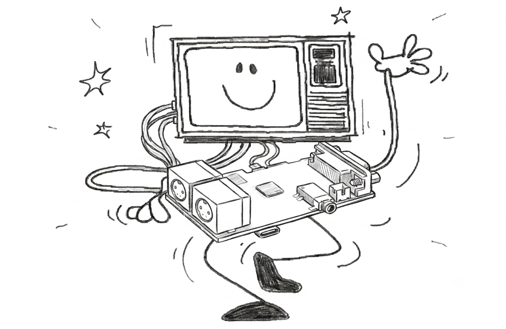

# TTGO-VGA32-COCO — CoCo 2 & CoCo 3 Emulator for the LilyGo TTGO VGA32



A full **TRS-80 Color Computer** (CoCo 2 and CoCo 3) emulator running on the **[LilyGo TTGO VGA32 v1.4](https://lilygo.cc/en-us/products/fabgl-vga32?_pos=1&_sid=4c095f59b&_ss=r)** board (ESP32-WROVER). Inspired on  [XRoar](http://www.6809.org.uk/xroar/) emulator.

**v0.9.0 — September 21, 2026** (LilyGo TTGO VGA32 port)

## Features

- **One firmware, two CoCos** — CoCo 2 and CoCo 3 live in the same binary. Pick your machine at boot from NVS or flip it live in the supervisor menu.
- **Cycle-accurate to the chip** — full MC6809 CPU emulation with accurate cycle counts, faithful enough to run the software that matters.
- **Authentic video, both eras** — MC6847 VDG for CoCo 2 (text plus every semigraphics and graphics mode) and the TCC1014 GIME for CoCo 3 (512 KB RAM with MMU, 16-color palette, native graphics up to 640 px), output over crisp VGA at 640×200 @ 60 Hz via FabGL in 64-color direct mode.
- **Real disk drives** — WD1793 floppy controller with `.DSK` and `.VDK` support, and entire disk images cached in PSRAM for zero-latency access.
- **Complete hardware soul** — dual 6821 PIAs (keyboard, joystick, audio I/O), SAM6883 multiplexer on CoCo 2, GIME-integrated MMU on CoCo 3.

### Built for Real Use

- **Multi-language keyboards** — PS/2 input with US English and Spanish Latam layouts, switchable live from Settings with no reboot.
- **Remap anything** — the supervisor Key Mapper lets you bind any physical key to any CoCo key, including the CoCo 3-only ALT, CTRL, CLEAR, F1 and F2.
- **Joystick via PS/2 mouse** — with live, on-screen sensitivity tuning persisted in NVS.
- **Real audio out** — ESP32 internal 8-bit DAC on GPIO25, straight to a 3.5 mm jack.
- **Supervisor OSD** — mount disks, reset the machine, change settings, and check status without ever leaving your seat.
- **Online debugging via WiFi + MCP (experimental)** — a WiFi debug server exposes a small HTTP/JSON API to inspect and control the running 6809 (registers, memory, pause/resume, code injection, reset, machine switch, screenshot). A host-side **MCP bridge** lets Claude / LLM agents drive it live. Set up from the supervisor's **WiFi / Debug** screen; see [docs/wifi-debug.md](docs/wifi-debug.md) and [`mcp-bridge/`](mcp-bridge/).
- **Experimental RS-232 Pak support** — for the serial tinkerers.

## Hardware Requirements

- **[LilyGo TTGO VGA32 v1.4](https://lilygo.cc/en-us/products/fabgl-vga32?_pos=1&_sid=4c095f59b&_ss=r)** (ESP32-WROVER-E, 4 MB PSRAM, 4 MB flash)
- **VGA monitor** capable of 640×200 @ 60 Hz (most VGA CRTs and adapters; some modern LCDs accept this mode, others won't sync)
- **PS/2 keyboard** plugged into the board's mini-DIN PS/2 jack
- **MicroSD card** (FAT32 formatted) inserted in the on-board socket
- **3.5 mm audio output** (mono) on the board's jack
- **5 V USB-C** for power and serial programming

> The board provides VGA, PS/2, audio jack, and SD socket on-board — no extra wiring is required. **Joystick 1 is emulated via the PS/2 mouse port** (GPIO26/27): plug a PS/2 mouse into the board's mouse header and it drives the CoCo right joystick. Joystick 2 is a neutral stub.

## Fixed Pin Map (TTGO VGA32 v1.4)

| Function | Pin(s) | Notes |
|---|---|---|
| VGA Red (R0, R1) | GPIO21, GPIO22 | Resistor-ladder DAC |
| VGA Green (G0, G1) | GPIO18, GPIO19 | Resistor-ladder DAC |
| VGA Blue (B0, B1) | GPIO4, GPIO5 | Resistor-ladder DAC |
| VGA HSYNC | GPIO23 | |
| VGA VSYNC | GPIO15 | |
| PS/2 Keyboard CLK | GPIO33 | |
| PS/2 Keyboard DATA | GPIO32 | |
| PS/2 Mouse CLK | GPIO26 | Joystick 1 emulation (PS/2 mouse) |
| PS/2 Mouse DATA | GPIO27 | Joystick 1 emulation (PS/2 mouse) |
| SD Card CS | GPIO13 | HSPI |
| SD Card MOSI | GPIO12 | HSPI |
| SD Card MISO | GPIO2 | HSPI (note: GPIO2 is a strapping pin — must float/high at boot) |
| SD Card SCK | GPIO14 | HSPI |
| Audio DAC | GPIO25 | ESP32 internal DAC1 |

## SD Card Setup

Format the MicroSD as **FAT32** and create the following structure:

### CoCo 2 ROMs

```
/roms/
├── bas13.rom          # Color BASIC 1.3 (required)
├── extbas11.rom       # Extended BASIC 1.1 (required)
└── disk11.rom         # Disk BASIC 1.1 (required for floppy support)
```

| File           | Size | Description                      |
|----------------|------|----------------------------------|
| `bas13.rom`    | 8 KB | Color BASIC 1.3 (primary)        |
| `extbas11.rom` | 8 KB | Extended BASIC 1.1 (primary)     |
| `disk11.rom`   | 8 KB | Disk BASIC 1.1 (primary)         |

### CoCo 3 ROMs

```
/roms/
├── coco3.rom          # Super Extended Color BASIC 2.0 (32 KB, required)
└── disk11.rom         # Disk BASIC (8 KB external cartridge ROM, starts with 'DK')
```

| File         | Size  | Description |
|--------------|-------|-------------|
| `coco3.rom`  | 32 KB | Super Extended Color BASIC (internal ROM, CRC: 0xb4c88d6c) |
| `disk11.rom` | 8 KB  | Disk BASIC cartridge ROM (must start with 'DK' signature at $C000) |

ROM files are validated by CRC-32 on startup.

### DriveWire / FujiNet ROMs (optional)

Only needed if you use the experimental [DriveWire / FujiNet support](#drivewire--fujinet-support-experimental)
below. Get them from [toolshed](https://github.com/n6il/toolshed)'s `hdbdos` build:

```
/roms/
├── hdbdw3bck.rom      # HDB-DOS 1.4, Becker port, CoCo 2 (8 KB)
├── hdbdw3bc3.rom      # HDB-DOS 1.4, Becker port, CoCo 3 (8 KB)
├── hdbdw3bckt.rom     # same, with a 2 s DriveWire timeout — CoCo 2 (optional)
└── hdbdw3bc3t.rom     # same, with a 2 s DriveWire timeout — CoCo 3 (optional)
```

These replace `disk11.rom` only while the DriveWire bus is enabled; with the
bus Off, `disk11.rom` loads as usual and floppy support is unaffected.

### Supported Disk Formats

- **`.DSK`** (JVC format) — fully supported
- **`.VDK`** (Virtual Disk with 12-byte header) — fully supported

## Build & Flash

### Quick Flash (Pre-built Firmware)

If you just want to flash the emulator without building from source, use the pre-built firmware binary and the browser-based ESP Web Flasher:

1. Connect your TTGO VGA32 board via USB
2. Open [ESP Web Tool](https://esptool.spacehuhn.com/) in a Chrome or Edge browser
3. Click **Connect** and select the board's serial port
4. Set the flash offset to **0x0000**
5. Choose the file `TTGO-VGA32-CoCo-0.9.0-firmware.bin` from this repository
6. Click **Program** and wait for the flash to complete

> Hold the **BOOT** button on the board while clicking Connect if the browser cannot reach the device.

Once flashed, prepare your SD card with the required ROM files (see [SD Card Setup](#sd-card-setup) above) and power-cycle the board.

---

### Running under ESP32_Bootloader (SD-card menu)

Since **v0.9.0** the emulator also ships as an [ESP32_Bootloader](https://github.com/ESP-WORKS/ESP32_Bootloader) payload, so it can share one board with other TTGO VGA32 emulators and be picked from an on-screen menu instead of being reflashed over USB.

Flash ESP32_Bootloader once (it lives in the `factory` partition), then put the release's `firmware.bin` and `version.txt` in a **`CoCo/`** folder on the card root — the folder name is what the menu lists:

```
/ (SD card root)
├── CoCo/
│   ├── firmware.bin      bare app image (NOT the merged -firmware.bin)
│   └── version.txt       one line; change it to force a reflash
└── roms/
    ├── coco3.rom
    └── disk11.rom        (plus bas13.rom / extbas11.rom for CoCo 2)
```

The ROMs and disk images stay in their usual places on the same card — the bootloader's card is also the emulator's card.

On selecting **CoCo**, the bootloader flashes the image into `ota_0` (only when `version.txt` differs from what it flashed last) and boots it. The emulator blanks `otadata` as the very first thing it does, so the **next power-cycle returns to the menu** rather than booting straight back in.

> **Use the right file.** `firmware.bin` from the SD package is the bare app image; `TTGO-VGA32-CoCo-<version>-firmware.bin` is the merged USB image and will *not* work from the menu. A bare image starts with byte `0xE9` — the build script checks this for you.

Notes and limits of this mode:

- The app must fit `ota_0` — **2816 KB**; v0.9.0 uses roughly 1.1 MB, so there is plenty of room.
- NVS (settings, key mappings, WiFi credentials, mounted disks) is shared with the bootloader and survives normally, but a full flash erase clears it.
- Nothing else changes: the standalone USB build is still the default and is unaffected.

---

### Building from Source

### 1. Install Arduino-CLI (or Arduino IDE 2.x)

This guide uses `arduino-cli`. The same FQBN and library list applies inside Arduino IDE.

### 2. ESP32 Board Support — **must be core 2.0.x**

FabGL 1.0.9 is **not compatible** with Arduino-ESP32 core 3.x (ESP-IDF 5). The board package URL and install command:

```bash
arduino-cli config add board_manager.additional_urls \
    https://espressif.github.io/arduino-esp32/package_esp32_index.json
arduino-cli core update-index
arduino-cli core install esp32:esp32@2.0.17
```

### 3. Install Required Libraries

```bash
arduino-cli lib install FabGL
```

`FabGL` provides VGA, PS/2 keyboard, and DAC drivers in one package. `SD` and `Preferences` ship with the ESP32 core.

### 4. Configure (optional)

Edit `config.h` if you want to change:

- `MACHINE_TYPE` — default compile-time machine (4 = CoCo 3, 3 = CoCo 2). The active machine is also runtime-switchable from the supervisor menu, persisted to NVS.
- `KBD_LAYOUT_FIRST_BOOT_DEFAULT` — initial PS/2 keyboard layout (0 = US English, 1 = Spanish Latam) used the first time the device boots. After that the layout is runtime-switchable (live, no reboot) from the supervisor Settings menu and persisted to NVS.

### 5. Compile & Upload

From the `coco3/` directory:

```bash
arduino-cli compile --fqbn esp32:esp32:esp32wrover:PartitionScheme=huge_app \
    TTGO-VGA32-COCO/

arduino-cli upload --fqbn esp32:esp32:esp32wrover:PartitionScheme=huge_app \
    -p /dev/ttyACM0 TTGO-VGA32-COCO/

arduino-cli monitor -p /dev/ttyACM0 -c baudrate=115200
```

If `Failed to connect to ESP32: Wrong boot mode detected`, hold the **BOOT** button on the board until the "Connecting..." dots appear, then release.

### 6. Building Release Images

`tools/build_firmware.sh` builds **both** distributable flavours from unmodified sources — they differ only by a command-line define, so there is nothing to edit between them:

```bash
tools/build_firmware.sh                     # both, version read from config.h
tools/build_firmware.sh 0.9.0               # both, explicit version
tools/build_firmware.sh 0.9.0 standalone    # merged USB image only
tools/build_firmware.sh 0.9.0 bootloader    # SD-card package only
```

| Output | What it is | How it's flashed |
|--------|-----------|------------------|
| `TTGO-VGA32-CoCo-<version>-firmware.bin` | Merged image: bootloader + partition table + `boot_app0` + app | USB, at offset **`0x0`** |
| `build/sdcard/CoCo/firmware.bin` | Bare app image (`-DBUILD_TARGET=1`) | By ESP32_Bootloader, into `ota_0` |
| `build/sdcard/CoCo/version.txt` | `CoCo.<version>-<git describe>` | Read by the bootloader to decide whether to reflash |

The script verifies what the binaries actually contain before publishing them: the SD image really starts with `0xE9` and fits `ota_0`, and — by disassembling `setup()` in each ELF — that the `otadata` erase is **present** in the bootloader build and **absent** from the standalone one. That last check matters because a define that silently fails to reach the sketch produces a bootloader package that never returns to the menu.

Version strings come from `FIRMWARE_VERSION` in `config.h`, which is also what the About screen and `/api/status` report. `version.txt` additionally folds in `git describe --tags --always --dirty`, so two builds of the same version are never mistaken for each other by the bootloader. Tag before building a release, and don't ship a `-dirty` string.

## Keyboard Controls

| Key | Function |
|-----|----------|
| F1  | Forwarded to CoCo 3 matrix (PA6,PB5) |
| F2  | Forwarded to CoCo 3 matrix (PA6,PB6) |
| F3  | Toggle OSD (supervisor menu) |
| F4  | Machine reset (flushes dirty disks first) |
| F5  | Toggle FPS overlay |
| F6  | Quick-mount last disk |
| ESC | BREAK |
| Backspace | LEFT ARROW (BASIC line edit) |
| Insert / Delete | CLEAR |

PS/2 keyboard layout defaults to **US English** and can be switched live (no reboot) to **Spanish Latam** from the supervisor **Settings** menu; the choice is persisted in NVS.

The shifted-symbol row is handled by FabGL's layout (it pre-resolves SHIFT+digit into `VK_HASH`, `VK_DOLLAR`, etc.); the HAL maps each symbol back to the corresponding CoCo SHIFT+N combination so `#`, `$`, `%`, `&`, `(`, `)`, `!`, `"`, `'`, `?`, `<`, `>`, `+` all produce the right CoCo character.

### Custom Key Mapping

The supervisor **Settings → Key Mapper** screen lets you remap any physical PS/2 key to a CoCo key (including the CoCo 3-only ALT, CTRL, CLEAR, F1, and F2 keys, which are hidden when a CoCo 2 is active). A **Test Mappings** mode shows what each pressed key would type without sending it to the emulated CoCo, and **Clear All Mappings** restores the defaults. Mappings persist in NVS.

## On-Screen Display (OSD)

Press **F3** to open the supervisor overlay. From here you can:

- **Mount/Eject Disks** — browse the SD card and mount `.DSK`/`.VDK` images to drives 0–3
- **Disk Manager** — view mounted drives and eject disks
- **Machine** — switch between CoCo 2 / CoCo 3 (`esp_restart()` after confirm; persisted to NVS)
- **Settings** — Debug Log, RS-232 Pak, **Keyboard** layout (US English / Spanish Latam, live switch), **Key Mapper** (custom key remapping), **Mouse Sensitivity** (joystick 1 / PS/2 mouse sensitivity adjustment, live preview), WiFi / Debug, and **DriveWire** (experimental FujiNet support — see below)
- **Reset Machine** — warm or cold reset with confirmation
- **About** — version info and free memory

## Architecture

The emulator runs on the ESP32-WROVER's **dual cores**, though under FabGL the video DMA is what consumes Core 1 timing — the emulation lives alongside it.

- **Core 0** — FabGL VGA scan-out timing and PS/2 ULP polling
- **Core 1** — Main emulation loop (CPU, video scanline render, audio, OSD)

### Emulation Loop

```
loop():
  1. hal_process_input()        — drain FabGL VK queue, tick deferred releases
  2. supervisor_update_and_render()  — if OSD active, render and return
  3. machine_run_frame()        — emulate 262 scanlines (14,916 CPU cycles)
  4. hal_render_frame()         — no-op on VGA32; FabGL DMA scans out continuously
```

### CoCo 2 Memory Map

```
$0000–$7FFF   RAM (up to 64 KB with SAM paging)
$8000–$9FFF   Extended BASIC ROM (8 KB)
$A000–$BFFF   Color BASIC ROM (8 KB)
$C000–$FEFF   Cartridge / Disk BASIC ROM (16 KB)
$FF00–$FF3F   PIA registers (keyboard, audio, VDG control)
$FF40–$FF5F   Disk controller (WD1793)
$FFC0–$FFDF   SAM control registers
```

### Architecture Diagrams

- `docs/ESP32_COCO_CORE.png` — CPU, memory map, PIA, VDG, SAM wiring
- `docs/Architecture.jpg` — system block diagram

## Project Structure

```
TTGO-VGA32-COCO.ino  Main Arduino sketch (setup/loop)
config.h                    Hardware and build configuration (BOARD_TYPE switch)
src/
├── core/                   Emulation core (HAL-agnostic)
│   ├── machine.h/cpp         CoCo machine — memory map, chip wiring, interrupts
│   ├── mc6809.h/cpp          MC6809 CPU — full opcode set with cycle-accurate timing
│   ├── mc6809_opcodes.h      Opcode table and cycle counts
│   ├── mc6821.h/cpp          6821 PIA — peripheral I/O
│   ├── mc6847.h/cpp          MC6847 VDG — scanline video rendering (CoCo 2)
│   ├── mc6551.h/cpp          MC6551 ACIA — RS-232 Pak chip emulation ($FF68-$FF6B)
│   ├── tcc1014.h/cpp         TCC1014 GIME — MMU, video, interrupts (CoCo 3)
│   ├── sam6883.h/cpp         SAM — address multiplexing and clock control
│   ├── sound.h/cpp           Sound mixing core — mux/DAC/single-bit, XRoar gain model
│   └── font_gime.h           GIME font ROM — 128 chars × 12 rows (PROGMEM)
├── hal/                    Hardware Abstraction Layer
│   ├── hal.h/cpp             HAL dispatcher (init, input, render)
│   ├── hal_video.cpp         FabGL VGAController (640×200 @ 60 Hz, 64-color)
│   ├── hal_audio.cpp         Internal DAC1 on GPIO25 via timer ISR
│   ├── hal_keyboard.cpp      FabGL PS/2 VirtualKey → CoCo matrix mapping
│   ├── hal_joystick.cpp      PS/2 mouse → CoCo joystick 1 (GPIO26/27); joystick 2 stub
│   ├── hal_rs232.h/cpp       RS-232 HAL — bridges MC6551 ACIA to UART0 (Serial)
│   ├── hal_storage.cpp       SD card access on dedicated HSPI
│   └── osd_canvas.h/cpp      OSD drawing API backed by FabGL Canvas (supervisor OSD)
├── supervisor/             On-Screen Display system (HAL-agnostic via osd_canvas)
│   ├── supervisor.h/cpp      OSD lifecycle and state machine
│   ├── sv_menu.h/cpp         Menu definitions and actions
│   ├── sv_disk.h/cpp         WD1793 FDC emulation and PSRAM cache
│   ├── sv_filebrowser.h/cpp  SD card file browser
│   ├── sv_render.h/cpp       OSD rendering (green phosphor theme)
│   ├── sv_debug.h/cpp        Debug overlay — CPU status, GIME state, memory dump
│   ├── sv_joystick.h/cpp     Mouse sensitivity screen — live cursor + adjust
│   └── sv_keymap.h/cpp       Key mapper UI — remap physical keys to CoCo characters
├── roms/
│   └── rom_loader.h/cpp      ROM loading with CRC-32 validation
├── tests/
│   └── integration_test.h/cpp  LOADM binary verification
└── utils/
    ├── debug.h               Debug output macros
    └── perf_probe.h/cpp      Lightweight esp_timer-based hot-path profiler
```

## Documentation

All technical documentation is in the `docs/` directory:

| File | Description |
|------|-------------|
| [Architecture.md](docs/Architecture.md) | System architecture — CoCo 2 and CoCo 3 extensions on TTGO VGA32 |
| [core.md](docs/core.md) | MC6809 CPU, MC6821 PIA, MC6847 VDG, SAM6883, GIME machine integration |
| [coco3-gime.md](docs/coco3-gime.md) | CoCo 3 GIME porting guide, register map, MMU |
| [disk-hal.md](docs/disk-hal.md) | WD1793 FDC emulation, HALT/NMI flow, PSRAM disk cache |
| [keyboard-hal.md](docs/keyboard-hal.md) | PS/2 → CoCo matrix mapping (note: older revisions describe the USB HID variant) |
| [supervisor.md](docs/supervisor.md) | OSD state machine, file browser, NVS persistence |
| [video.md](docs/video.md) | Video rendering pipeline, scale modes, palette |
| [audio-hal.md](docs/audio-hal.md) | Audio path, ISR, PIA DAC routing |
| [joystick-hal.md](docs/joystick-hal.md) | Joystick HAL — PS/2 mouse as CoCo joystick 1, comparator emulation, lessons learned |
| [rs232-hal.md](docs/rs232-hal.md) | RS-232 Pak emulation, MC6551 ACIA, HAL bridge |
| [runtime-machine-switch.md](docs/runtime-machine-switch.md) | Runtime CoCo 2 / CoCo 3 switching, NVS state |

## Known Limitations

- DMK disk format is recognized but not mountable
- Max 128 file entries in the SD card browser
- Joystick 2 (left port) is a stub — returns centered, button released; only Joystick 1 is active via PS/2 mouse
- NTSC composite simulation covers RG6 (PMODE 4) artifact colour only — there is no
  chroma/luma bleed modelling for the other modes
- Supervisor OSD was sized for 320×240; on the 640×200 VGA surface its layout sits in the upper-left region

## DriveWire / FujiNet Support (Experimental)

The emulator can talk **DriveWire** over an emulated **Becker port**
(`$FF41` status / `$FF42` data — the same virtual port XRoar, MAME and VCC
use), paired with the HDB-DOS DriveWire ROMs. Because `fujinet-lib` and
CONFIG only ever go through HDB-DOS's `DWRead`/`DWWrite` vectors, the Becker
port is transparent to CoCo software — the same ROM that boots off a plain
DriveWire server also boots FujiNet's CONFIG app.

**What works today (External mode):**
- A TCP client to an external DriveWire/FujiNet server — [pyDriveWire](https://github.com/n6il/pyDriveWire)
  (Python 2), DW4, or [FujiNet-PC](https://github.com/FujiNetWIFI/fujinet-firmware)
  (`./build.sh -p COCO`) — on port 65504.
- HDB-DOS boots automatically once the bus is enabled, giving `DIR`, `LOADM`,
  `SAVE`, disk images, and — via FujiNet-PC — the CONFIG app, TNFS/HTTP disk
  mounts, the `N:` network device and the clock.
- Reconnects on its own after a CoCo reset or a link drop.

**Turning it on:** F3 → Settings → DriveWire → Mode: External, set Host/Port
(default 65504), Save & Restart. Requires the HDB-DOS ROMs above on the SD card.

**Known issue — FujiNet-PC's default read timeout.** FujiNet-PC's Becker-over-IP
transport waits only 500 ms per byte by default. Since TCP never loses a byte
(only delays it), a brief WiFi retransmit can occasionally exceed that and
desync the DriveWire stream (a `Checksum error` in FujiNet-PC's log, followed
by the CoCo hanging). A one-line patch that raises this to 5 s ships at
`tools/fujinet-pc-boip-timeout.patch` — apply it to your `fujinet-firmware`
checkout before `./build.sh -p COCO` if you see this. Using the `t`-suffixed
HDB-DOS ROMs (2 s DriveWire timeout, retries instead of hanging) is a
complementary mitigation on the CoCo side.

**Not yet implemented:**
- **Internal DriveWire mode** — a disk-only DriveWire server built into the
  firmware itself (serving `.DSK` images from the SD card, no PC needed).
- **Internal FujiNet mode** — the FUJI (`0xE2`) and NET (`0xE3`) devices
  embedded in the firmware, so CONFIG/TNFS/`N:` work standalone.

Both are on the [roadmap](#planned) below.

## Planned

- **Internal DriveWire / FujiNet** — *ongoing*, next phase of the work above. A
  disk-only DriveWire server built into the firmware (no PC required), followed
  by an embedded FujiNet FUJI/NET device dispatcher.
- **HD6309 CPU support** — *ongoing*. `CPU_VARIANT` already exists in `config.h`, but the core currently emulates the MC6809 only; the 6309's native mode, extra registers and inline instructions are not implemented yet.
- Testing and adjustment of RS-232 Pak support
- Migrate to an MQTT-based MCP Bridge gateway (replacing the current WiFi API)

## Changelog

### v0.10.0 — September 23, 2026

**Experimental DriveWire / FujiNet support (External mode).** See
[DriveWire / FujiNet Support](#drivewire--fujinet-support-experimental) above.

- **`src/core/becker.*`** — an emulated Becker port (`$FF41`/`$FF42`) with
  lock-free ring buffers between the CPU core and a core-0 network task;
  flushes and reconnects cleanly across CoCo resets and link drops.
- **`src/net/dw_client.*` / `dw_bus.*`** — a TCP DriveWire client to an
  external server (pyDriveWire, DW4, FujiNet-PC), with settings (mode, host,
  port, HDB-DOS ROM variant) in NVS and a new `/api/bus` debug endpoint.
- **HDB-DOS ROM selection** — `hdbdw3bck.rom`/`hdbdw3bc3.rom` load in place of
  `disk11.rom` while the bus is enabled, with automatic fallback (and an OSD
  warning) if they're missing.
- **New Settings → DriveWire OSD screen** to configure and monitor the link.
- **`tools/dw_test_server.py`**, **`tools/dw_proxy.py`** — a minimal Python 3
  DriveWire test server and a logging TCP proxy, for testing without a full
  FujiNet-PC install.
- Closes the DriveWire socket cleanly before any supervisor-triggered restart,
  so an external server isn't left holding a dead connection.

### v0.9.0 — September 21, 2026

**ESP32_Bootloader support.** The emulator can now be launched from
[ESP32_Bootloader](https://github.com/ESP-WORKS/ESP32_Bootloader)'s SD-card menu,
so one TTGO VGA32 can hold several emulators and switch between them without a
USB cable. See [Running under ESP32_Bootloader](#running-under-esp32_bootloader-sd-card-menu).

- **New `BUILD_TARGET` switch in `config.h`**, defaulting to standalone. The
  bootloader image is selected with `-DBUILD_TARGET=1` on the command line, so
  both flavours build from identical sources and the USB build is untouched.

- **`otadata` is blanked at the top of `setup()`** in bootloader builds, before
  Serial, video or the SD probe. Without it the ESP32 would boot this app on
  every power-up and the menu would become unreachable; with it, the ROM falls
  back to the `factory` partition and the menu returns. The call compiles out
  entirely in standalone builds.

- **No partition-scheme change.** An ESP32 app image carries no partition table
  and both `0x10000` and `ota_0`'s `0x130000` are 64 KB-aligned, so the same app
  runs at either offset. `huge_app` stays the standalone scheme.

- **`tools/build_firmware.sh` now builds both images** and validates them:
  `0xE9` bare-image magic, the 2816 KB `ota_0` size limit, and a disassembly
  check that the `otadata` erase is present in the bootloader build and absent
  from the standalone one — the one failure that is otherwise silent.

### v0.81 — September 2, 2026

**CoCo 2 VDG colour accuracy.** Two bugs in the MC6847 path cancelled each other
out, so artifact-colour games looked correct while true 4-colour games did not.

- **PMODE 4 (RG6) is no longer rendered as PMODE 3 (CG6).** The VDG's GM0–GM2
  mode bits were being taken from the SAM's V0–V2. On real hardware they come
  from PIA1 PB4–PB6; the SAM's V bits only describe fetch geometry, which CG6
  and RG6 share (both `V=110`, 6144 bytes, 32 per row), so the SAM cannot tell
  the two apart. Every PMODE 4 screen was being decoded as 2bpp colour.

- **CG6 with CSS=1 now uses the MC6847's real palette** — buff, cyan, magenta,
  orange — in place of the NTSC artifact quad. Fixes titles such as *Pooyan*,
  which rendered as black/blue/orange/white.

- **NTSC artifact colour is now emulated where it actually occurs:** the 1bpp
  RG6 path, where the pixel clock runs at the colour-subcarrier rate and a
  composite TV decodes adjacent pixel *pairs* as black / blue / orange / white.
  Always on, matching XRoar's default for NTSC machines — games such as
  *Zaxxon* are drawn for it and are near-unreadable without it. The
  lower-resolution RG modes clock at half that rate and stay monochrome.

Verified against XRoar on hardware: the *Pooyan* title screen now matches the
reference pixel-for-pixel (0 of 49152 pixel codes differ), and injected RG6 and
CG6 test patterns produce the correct palette in each mode.

## ⚠️ Vibe Coding Alert

Full transparency: this project was built by an ESP32 hobbyist working with AI coding assistants, not a professional embedded/C++ developer. If you're an experienced embedded engineer, you might look at this codebase and wince. That's okay.

The goal here was to scratch an itch — get a CoCo 2/3 emulator running on cheap VGA32 hardware — and learn along the way. The code works, but it's likely missing patterns, optimizations, or elegance that only years of embedded/C++ experience can provide.

This is where you come in. If you see something that makes you cringe, please consider contributing rather than just closing the tab. This is open source specifically because human expertise is irreplaceable. Whether it's refactoring, better error handling, cycle-accuracy fixes, or architectural guidance — PRs and issues are welcome.

Think of it as a chance to mentor an AI-assisted developer through code review. We all benefit when experienced developers share their knowledge.

## Credits

- **Reinaldo Torres / CoCo Byte Club** — ESP32 port and hardware design — [reyco2000@cocobyte.club](mailto:reyco2000@cocobyte.club)
- **Ciaran Anscomb** — [XRoar](http://www.6809.org.uk/xroar/) CoCo/Dragon emulator (original source)
- **Claude Code (Anthropic)** — co-development of the ESP32 port
- **Fabrizio Di Vittorio** — [FabGL](http://www.fabgl.com/) VGA / PS/2 / DAC library

## License

This project is licensed under the **GPL-3.0**.
